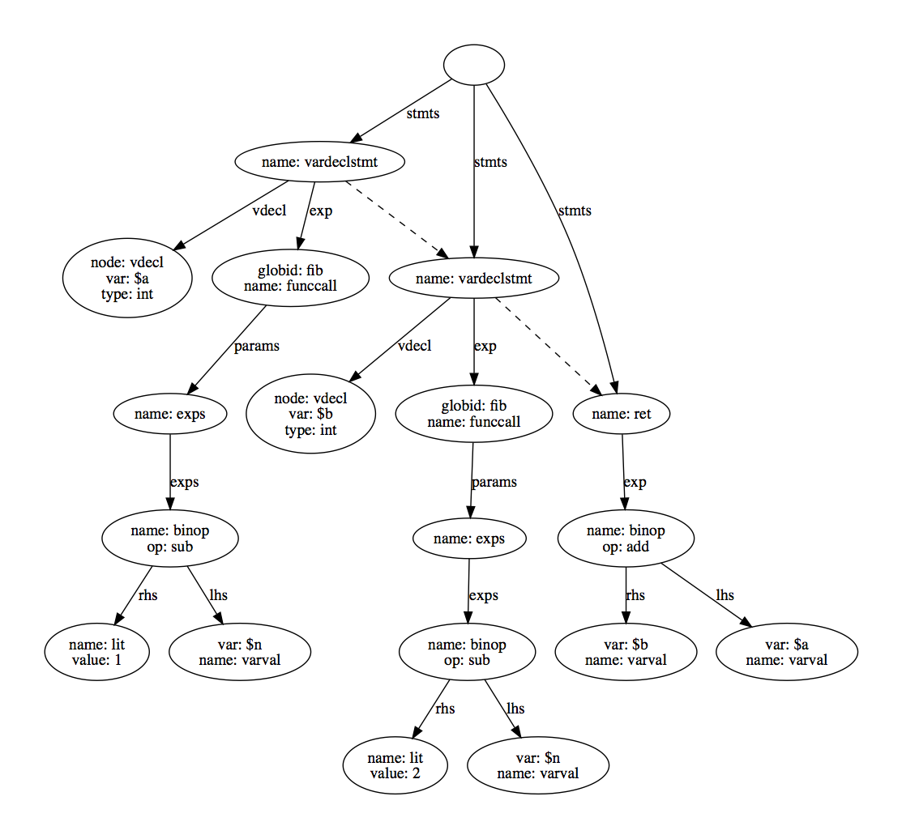

# yaml-ast
Since the structure of YAML is whitespace-oriented, this tool allows you to visualize the structure of a YAML document as a directed graph.
A major use-case is to visualize Abstract Syntax Trees (ASTs) that are serialized in YAML.

### Requirements

You need Python 2.7.x, PyYAML, and GraphViz installed:

```
sudo pip install pyyaml
brew install graphviz
```

### Usage

The `show.py` script will take a YAML file-path as a command line argument and will output a GraphViz directed graph to standard output.

```
python show.py test/sample.yaml > graph.gv    # save output to a new file
dot -Tpdf graph.gv -o render.pdf              # use GraphViz to render as PDF
```

### Example

The following tree was generated from the YAML below it.



```yaml
stmts:
    -
      name: vardeclstmt
      vdecl:
        node: vdecl
        type: int
        var: $a
      exp:
        name: funccall
        globid: fib
        params:
          name: exps
          exps:
            -
              name: binop
              op: sub
              lhs:
                name: varval
                var: $n
              rhs:
                name: lit
                value: 1
    -
      name: vardeclstmt
      vdecl:
        node: vdecl
        type: int
        var: $b
      exp:
        name: funccall
        globid: fib
        params:
          name: exps
          exps:
            -
              name: binop
              op: sub
              lhs:
                name: varval
                var: $n
              rhs:
                name: lit
                value: 2
    -
      name: ret
      exp:
        name: binop
        op: add
        lhs:
          name: varval
          var: $a
        rhs:
          name: varval
          var: $b

```
